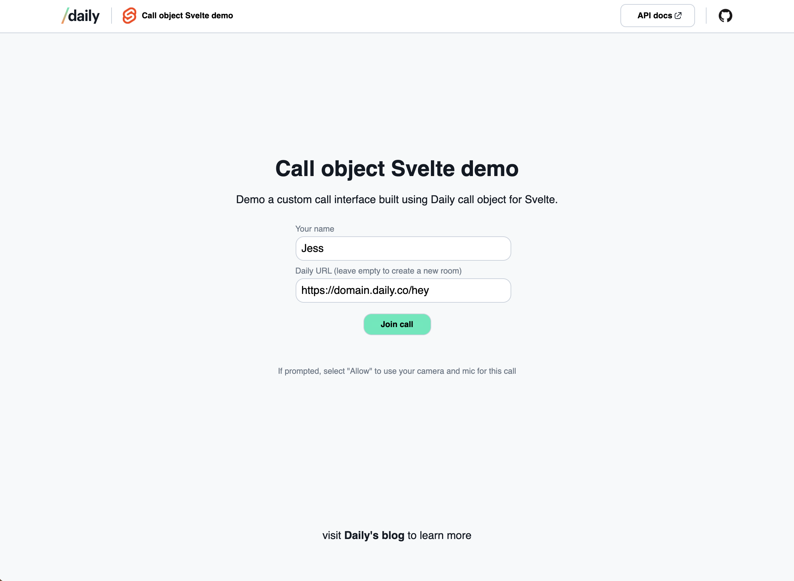
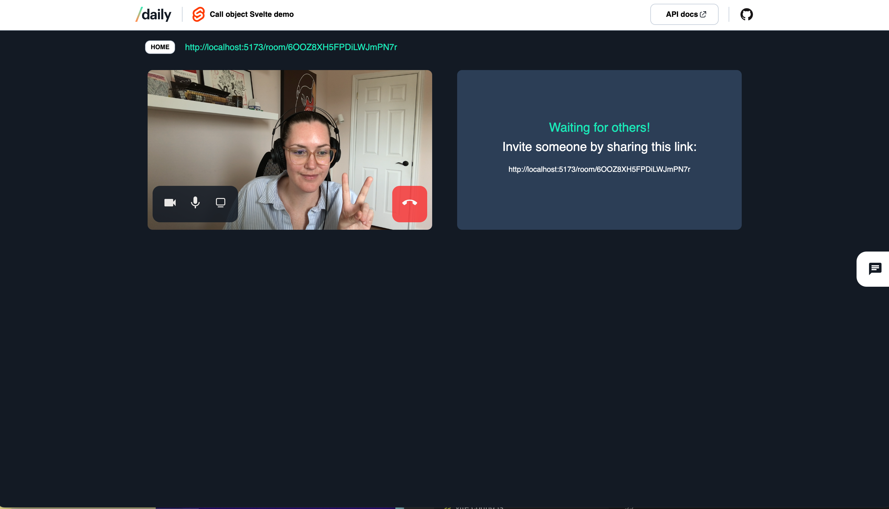

# SvelteKit + Ant Media video call demo

This project demonstrates a custom video call and viewroom experience using [SvelteKit](https://kit.svelte.dev/), [Ant Media Server](https://antmedia.io/) (WebRTC), and real-time sync (chat, media, zoom/pan).




---

## Getting set up

### Prerequisites

- [Node.js](https://nodejs.org/) (v18+)
- [pnpm](https://pnpm.io/) (`npm i -g pnpm`)

### 1. Clone and install

```bash
git clone <repo-url>
cd demo-stream
pnpm install
```

### 2. Environment variables

Create `.env` (or `.env.local`) in the project root. Required for full functionality:

```bash
# Ant Media Server (WebRTC)
PUBLIC_ANT_MEDIA_URL=wss://your-antmedia-host.com

# Optional: email, SMS, storage
PUBLIC_SMTP_FROM=
PUBLIC_BREVO_SENDER_EMAIL=
BREVO_API_KEY=
PUBLIC_POCKETBASE_INSTANCE=
```

### 3. Run locally

```bash
pnpm run dev
```

Open **http://localhost:3001** (or the port shown in the terminal).

---

## Tutorial

Follow these steps to try the app end-to-end.

### Step 1: Sign in or continue as guest

- Go to the app home page.
- **Log in** (if you have an account) or **continue as guest** to access rooms and the viewroom dashboard.

### Step 2: Create or open a room

- From the app home or dashboard, **create a new room** or open an existing one.
- You’ll land on the room page with video, chat, and content panels.

### Step 3: Join the call

- Allow camera and microphone when the browser prompts.
- Your video and name appear in the participants list.
- Use the in-call controls to **mute/unmute** and **turn camera on/off**.

### Step 4: Use chat and participants

- Open the **Chat** panel (sidebar) to send messages to everyone in the room.
- Open the **Participants** panel to see who’s in the call and invite links.

### Step 5: Share and control content

- Use the **media/content selector** to choose a PDF, image, or document to share.
- As the **controller** (host or current presenter):
  - **Zoom**: use the +/- buttons or Ctrl/Cmd + scroll on the image viewer.
  - **Pan**: click and drag on the shared image (drag works even when the cursor leaves the viewer).
- Other participants see the same zoom and pan in sync.

### Step 6: Representatives and viewroom

- Join as a **representative** (or open the representative flow) to use rep-specific content and controls.
- Use **ViewRoom** (viewroom login/dashboard) for the customer-facing view and scheduled meetings.

### Step 7: Leave and rejoin

- Click **Leave** to exit the call. You can rejoin the same room via the room URL or from the dashboard.
- Room URLs can be shared so others can join the same call.

---

## Demo features

- Create and join rooms with WebRTC (Ant Media)
- Multi-participant video and audio
- Real-time chat (in-memory; optional persistence can be added)
- Content sharing: PDF, images, DOCX with zoom/pan sync
- Local device controls (mic, camera)
- Host vs representative roles and viewroom flow
- Scheduled meetings and viewroom dashboard

## Tech stack

- **Frontend:** SvelteKit, Svelte 5, Tailwind CSS
- **Real-time:** Ant Media WebRTC, WebSocket messaging for chat and media sync
- **Optional:** Brevo (email), Drizzle + PostgreSQL

## Scripts

| Command           | Description                    |
|-------------------|--------------------------------|
| `pnpm run dev`    | Start dev server (port 3001)   |
| `pnpm run build`  | Production build               |
| `pnpm run preview`| Preview production build       |
| `pnpm run lint`   | Lint and format check          |
| `pnpm run format` | Format with Prettier           |

---

## Additional information from SvelteKit

Before creating a production version of your app, install an [adapter](https://kit.svelte.dev/docs#adapters) for your target environment. Then:

```bash
pnpm run build
```

> You can preview the built app with `pnpm run preview`. Do not use it to serve the app in production.
